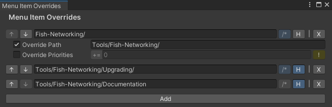
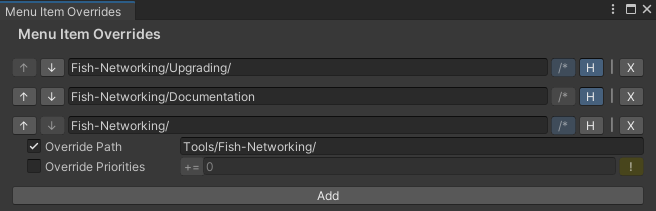

# Menu Item Overrides

Don't you just hate it when you install a few assets or packages and  then your menu ends up looking like one of those old Internet Explorer installations with like 20 toolbar extensions?

Looks pretty comparable to us.

**Well we have just the solution for you!**

With this package, you can turn that 👆 into this 👇!

## Installation

TBA

## Dependencies

TBA

## Configuration

With the package installed, you can open the Menu Item Overrides window by using the `Tools/Menu Item Overrides/Configuration` menu item.

This window allows you to add a list of overrides for menu items, which can modify the path of the menu item, the priority, or both.

- By pressing the `H` button, you can hide the menu item entirely.
- By enabling `Override Path`, you can specify a new location for the menu item.
- By enabling `Override Priority`, you can specify a new priority for the menu item. `+=` indicates that the specified priority is an offset and will be added to the original, and `=` indicates that the original priority will be overriden entirely.
- Paths ending in `/` are expected to be submenus, and will be treated as such (which will be indicated by the lit up `/*` on the right). Since submenus don't have their own priority, but instead are ordered based on their children, `+=` is the only availably priority override strategy for them. 

**Overrides are applied top-to-bottom**, meaning that the following two setups are equivalent:

### Additional features

- You can use the `Debug Mode` toggle to append the priorities of each item to the end of their path, so you can better see how to modify them. (This is not present in any of the above screenshots because we took them before we added this feature, but we think you can find the button on your own 🙂)
- By going to `Tools/Menu Item Overrides/See Report...` you can see a list of all of the menu items and their priorities _before_ they were modified by this package.

### Limitations

Only menu items created with the `[MenuItem]` attribute can be modified. built-in menu items cannot be modified 

## Known issues

- Submenus seem to somehow be cached, so changing the priority override of a submenu will only take effect if the editor is restarted or if the submenu is moved, or hidden and unhidden.
- When installing or uninstalling the package the assemblies will not be refreshed, so the menu items will not be updated.

## Getting involved

The project is pretty barebones now, so we welcome any and all contributions, whether it's reporting bugs, suggesting new features, or submitting code improvements.
